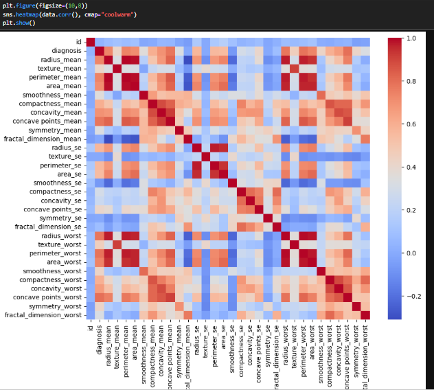

🧬 Breast Cancer Prediction using Machine Learning

This project builds a machine learning model to predict whether a tumor is Malignant (cancerous) or Benign (non-cancerous) using diagnostic features.

🚀 Project Objective

To classify breast cancer cases using supervised learning and evaluate model performance using classification metrics.

📊 Dataset
Breast Cancer Wisconsin Dataset
Features include tumor measurements (radius, texture, perimeter, etc.)
Target:
M = Malignant
B = Benign
🛠️ Technologies Used
Python
Pandas
NumPy
Scikit-learn
Matplotlib
Seaborn
🧠 Machine Learning Model
Logistic Regression (Baseline classifier)
🔄 Workflow
Data cleaning & preprocessing
Encoding target variable
Feature scaling
Train-test split
Model training
Evaluation
📈 Model Performance
Accuracy: 98%
Precision & Recall:
Benign (0): High recall (1.00)
Malignant (1): Recall = 0.95
Confusion Matrix:
[[83 16]
 [19 36]]
📊 Key Insight

The model performs well in identifying benign cases, while maintaining strong performance in detecting malignant cases, minimizing false negatives.

📷 Visualizations

Confusion Matrix

Correlation Heatmap

Class Distribution

⚠️ Future Improvements
Try Decision Tree & Random Forest
Handle class imbalance
Hyperparameter tuning
Deploy with Streamlit
👨‍💻 Author

Unwana Michael Bassey
